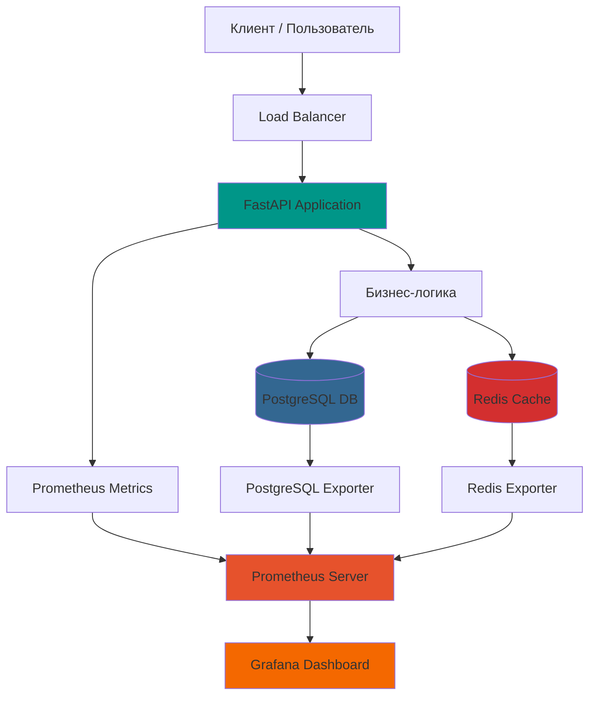

# 🚀 Тестовое задание №6: Production-ready REST API для управления задачами

**Полнофункциональное микросервисное приложение с продвинутой архитектурой, кэшированием и комплексным мониторингом**

## 📋 Оглавление
- [🎯 Обзор проекта](#-обзор-проекта)
- [✨ Особенности реализации](#-особенности-реализации)
- [🏗️ Архитектура системы](#️-архитектура-системы)
- [🚀 Быстрый старт](#-быстрый-старт)
- [📚 Документация API](#-документация-api)
- [🔍 Расширенные возможности](#-расширенные-возможности)
- [📊 Система мониторинга](#-система-мониторинга)
- [⚡ Производительность](#-производительность)
- [🛠️ Технологический стек](#️-технологический-стек)
- [📁 Структура проекта](#-структура-проекта)
- [🔧 Настройка и конфигурация](#-настройка-и-конфигурация)
- [🧪 Примеры использования](#-примеры-использования)
- [📈 Метрики и мониторинг](#-метрики-и-мониторинг)

## 🎯 Обзор проекта

### Основная задача
Разработать REST API для управления задачами (CRUD операции) в соответствии с требованиями тестового задания.

### Реализованные возможности
- ✅ **Базовые CRUD операции** над задачами
- ✅ **Асинхронная архитектура** для высокой производительности
- ✅ **Многоуровневое кэширование** с использованием Redis
- ✅ **Полноценная система мониторинга** с Prometheus и Grafana
- ✅ **Контейнеризация** всех компонентов через Docker Compose
- ✅ **Health checks** и автоматическое восстановление
- ✅ **Подробные метрики** для каждого эндпоинта API

## ✨ Особенности реализации

### 🚀 Производительность
- **Асинхронные операции** с использованием async/await
- **Intelligent caching** с автоматической инвалидацией
- **Connection pooling** для PostgreSQL и Redis
- **Оптимизированные SQL-запросы** с индексами

### 🛡️ Надежность
- **Graceful shutdown** корректное завершение работы
- **Health checks** для всех сервисов
- **Retry логика** при ошибках подключения
- **Persistent volumes** для сохранения данных

### 📊 Наблюдаемость
- **Детализированные метрики** для каждого эндпоинта
- **Автоматическое обнаружение** сервисов Prometheus
- **Готовые дашборды** Grafana
- **Экспортеры метрик** для PostgreSQL и Redis

## 🏗️ Архитектура системы

