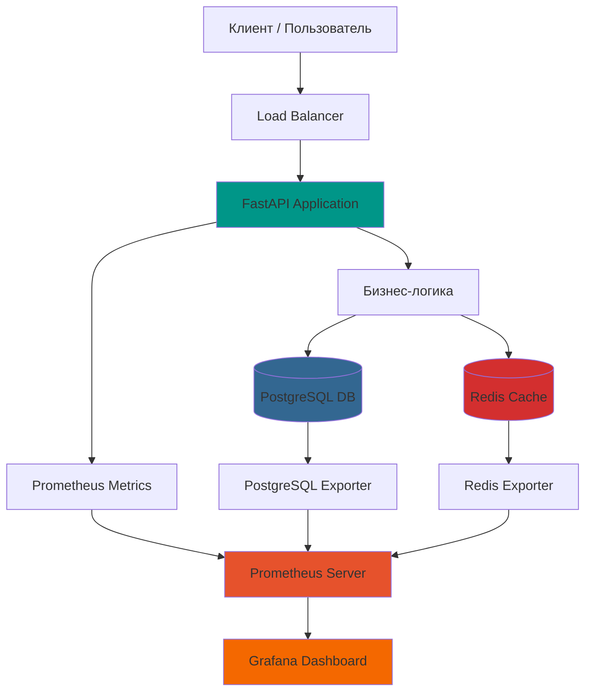

# 🚀 Тестовое задание №6: Production-ready REST API для управления задачами

**Полнофункциональное микросервисное приложение с продвинутой архитектурой, кэшированием и комплексным мониторингом**

[](https://fastapi.tiangolo.com)
[](https://www.postgresql.org)
[](https://redis.io)
[](https://www.docker.com)
[](https://prometheus.io)
[](https://grafana.com)

## 📋 Оглавление
- [🎯 Обзор проекта](#-обзор-проекта)
- [✨ Особенности реализации](#-особенности-реализации)
- [🏗️ Архитектура системы](#️-архитектура-системы)
- [🚀 Быстрый старт](#-быстрый-старт)
- [📚 Документация API](#-документация-api)
- [📊 Система мониторинга](#-система-мониторинга)
- [📁 Структура проекта](#-структура-проекта)
- [🔧 Настройка и конфигурация](#-настройка-и-конфигурация)
- [📈 Метрики и мониторинг](#-метрики-и-мониторинг)

## 🎯 Обзор проекта

### Основная задача
Разработать REST API для управления задачами (CRUD операции) в соответствии с требованиями тестового задания.

### Реализованные возможности
- ✅ **Базовые CRUD операции** над задачами
- ✅ **Асинхронная архитектура** для высокой производительности
- ✅ **Многоуровневое кэширование** с использованием Redis
- ✅ **Полноценная система мониторинга** с Prometheus и Grafana
- ✅ **Контейнеризация** всех компонентов через Docker Compose
- ✅ **Health checks** и автоматическое восстановление
- ✅ **Подробные метрики** для каждого эндпоинта API

## ✨ Особенности реализации

### 🚀 Производительность
- **Асинхронные операции** с использованием async/await
- **Intelligent caching** с автоматической инвалидацией
- **Connection pooling** для PostgreSQL и Redis
- **Оптимизированные SQL-запросы** с индексами

### 🛡️ Надежность
- **Graceful shutdown** корректное завершение работы
- **Health checks** для всех сервисов
- **Retry логика** при ошибках подключения
- **Persistent volumes** для сохранения данных

### 📊 Наблюдаемость
- **Детализированные метрики** для каждого эндпоинта
- **Автоматическое обнаружение** сервисов Prometheus
- **Готовые дашборды** Grafana
- **Экспортеры метрик** для PostgreSQL и Redis

## 🏗️ Архитектура системы


## 🚀 Быстрый старт

### Предварительные требования
- Docker 20.10+
- Docker Compose 2.0+
- 2 ГБ свободной памяти
- Порты 8000, 9090, 3000 свободны

### Установка и запуск

1. **Сборка Docker образа приложения**
```bash
# Перейдите в директорию проекта
cd tfss/app

# Соберите Docker образ с тегом test_app
docker build -t test_app .
```
2. **Запуск всех сервисов через Docker Compose**
```bash
# Вернитесь в корневую директорию проекта
cd ..

# Запустите все сервисы
docker-compose up -d

# Или с пересборкой образов
docker-compose up --build -d
```
3. **Быстрые команды**
```bash
# Остановка всех сервисов
docker-compose down

# Остановка с очисткой данных
docker-compose down -v

# Перезапуск приложения
docker-compose restart app

# Просмотр логов в реальном времени
docker-compose logs -f --tail=50 app
```
## 📚 Документация API
### Интерактивная документация Swagger
Полная интерактивная документация API доступна по адресу:

```text
http://localhost:8000/docs

```
В Swagger UI вы можете:
- Просматривать все доступные эндпоинты
- Видеть параметры запросов и форматы ответов
- Тестировать API прямо в браузере
- Скачивать OpenAPI спецификацию
## 📊 Система мониторинга
### Дашборды Grafana

Для быстрого начала работы с мониторингом рекомендуем импортировать следующие готовые дашборды:

| Название | ID дашборда | Описание |
|----------|-------------|----------|
| Node Exporter Full | 1860 | Полный обзор метрик системы (CPU, память, диск, сеть) |
| Redis Dashboard | 768 | Мониторинг Redis (память, подключения, команды, ключи) |
| PostgreSQL Database | 9628 | Мониторинг PostgreSQL (запросы, подключения, блокировки) |
| Prometheus 2.0 Stats | 3662 | Мониторинг самого Prometheus |
Инструкция по импорту дашбордов:
Войдите в Grafana (http://localhost:3000, admin/admin)

Нажмите "New" → "Import"

Введите ID дашборда (например, 1860 для Node Exporter)

Выберите источник данных Prometheus

Нажмите "Import"
